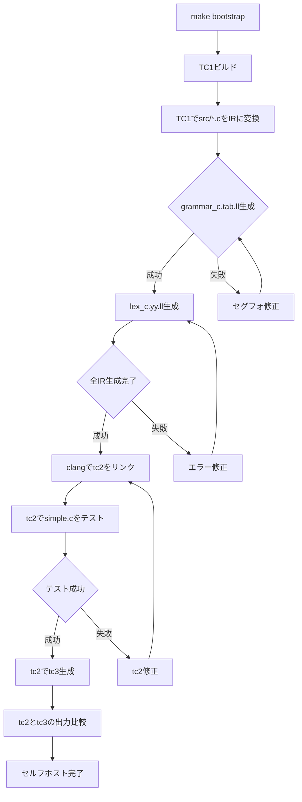

# Implementation Plan: Self-hosting Tiny-C Compiler

## 現状 (2026-02-08)

### ブートストラップ状況

- **TC1 (ccompiler_c)**: GCCで正常にビルド可能 ✓
- **IR生成**: 以下のファイルは成功
  - memory.c → memory.ll (10,576 bytes) ✓
  - error.c → error.ll (3,978 bytes) ✓
  - ast.c → ast.ll (93,159 bytes) ✓
  - symbols.c → symbols.ll (23,072 bytes) ✓
  - codegen.c → codegen.ll (380,246 bytes) ✓
  - main.c → main.ll (13,071 bytes) ✓
- **grammar_c.tab.c**: Segmentation faultで失敗 ✗
- **lex_c.yy.c**: 未達（grammarで失敗するため）

### エラー分析

- **クラッシュ箇所**: `strlen`関数でのNULLポインタアクセス
- **原因**: codegen中に文字列操作でNULLが渡されている
- **対象**: YYSTYPE構造体のような複雑なunion/structを含むコード

---

## Phase 1-4: 完了済み [checkpoints: f94307d, 0b05059, c1ae203, 1e42226]

詳細は省略（以前のプランを参照）

---

## Phase 5: Bootstrapping修正 [current]

TC1によるIR生成を完了し、tc2を生成することを目指す。

### Task 5.1: grammar_c.tab.cのセグフォ修正

- [ ] Task: codegen.cのNULLチェック強化
  - `llvm_type_to_string()` でNULLのstruct_nameを処理
  - `format_operand()` でNULLのnameを処理
  - `cast_to_type()` でNULLチェックを追加
- [ ] Task: デバッグビルドでクラッシュ箇所を特定
  - `make debug` でデバッグシンボル付きビルド
  - lldbで正確なクラッシュ箇所を特定
- [ ] Task: 修正後にgrammar_c.tab.llが生成されることを確認

### Task 5.2: lex_c.yy.cのIR生成

- [ ] Task: grammar修正後にlex_c.yy.cのIR生成を試行
- [ ] Task: エラーが発生した場合は修正

### Task 5.3: tc2のリンクと実行

- [ ] Task: 全IRファイルをclangでリンクしてtc2を生成
- [ ] Task: tc2でsimple.cをコンパイルして動作確認
- [ ] Task: tc2で自分自身をコンパイルしてtc3を生成（目標）

### Task 5.4: 検証

- [ ] Task: tc2とtc3の出力比較（機能的パリティ確認）
- [ ] Task: Conductor - User Manual Verification 'Phase 5'

---

## 技術的な修正メモ

### 想定される修正箇所

1. **src/codegen.c - llvm_type_to_string()**

   ```c
   // 修正前
   sprintf(buf, "%%struct.%s", type->struct_name);

   // 修正後
   sprintf(buf, "%%struct.%s", type->struct_name ? type->struct_name : "anon");
   ```

2. **src/codegen.c - format_operand()**

   ```c
   // NULLチェックを追加
   if (!val || !val->name) return "";
   ```

3. **src/codegen.c - cast_to_type()**

   ```c
   // より堅牢なNULLチェック
   if (!val || !val->llvm_type || !target_type) return val;
   ```

### デバッグ手順

```bash
# デバッグビルド
make clean && make CFLAGS="-Wall -Wextra -g -O0 -std=c99 -Isrc -DTC1"

# lldbで実行
lldb ./ccompiler_c
(lldb) run build/bootstrap/grammar_c.tab.pre.c

# クラッシュ時にバックトレース確認
(lldb) bt
```

---

## フロー図


